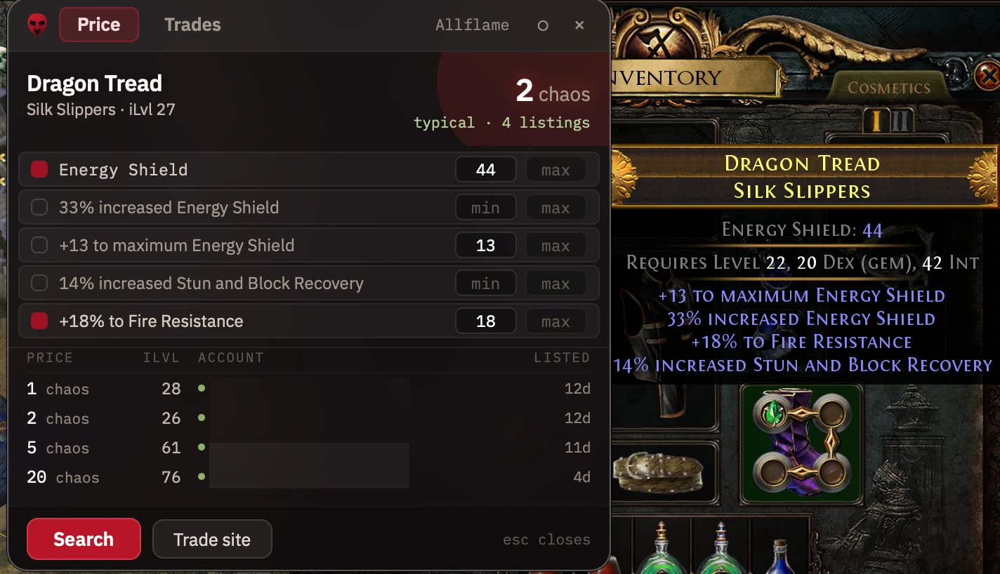
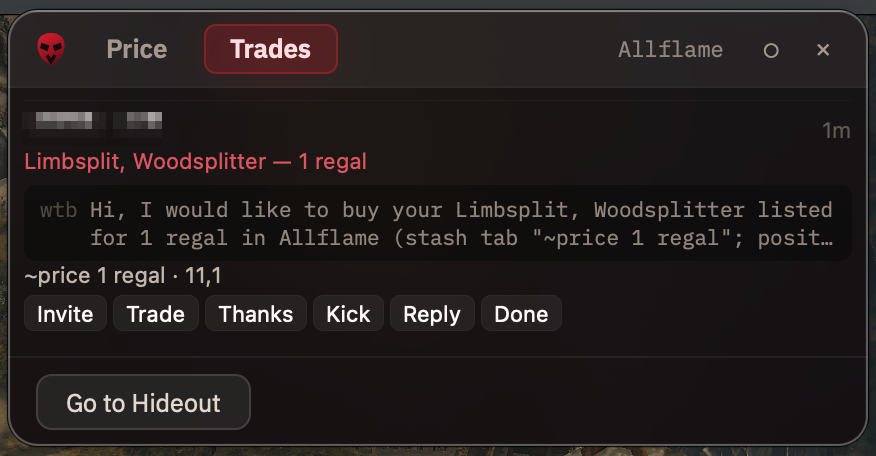

# Vaaluation

Item price checking for **Path of Exile** on macOS. Hover an item, press a
shortcut, see what comparable items are actually listed for — without leaving
the game.

Free, open source, no accounts, no telemetry, no paid tier.

> This product isn't affiliated with or endorsed by Grinding Gear Games in any
> way.

---

| Price check | Trade requests |
| --- | --- |
|  |  |

## Why this exists

The established price-check tools target Windows and Linux; macOS support tends
to be partial, with global shortcuts that never fire. Vaaluation is built
natively for macOS — a menu-bar app with an AppKit shell, a real non-activating
overlay panel, and Carbon global hotkeys that work.

## What it does

- **Price check** — hover an item, press <kbd>Ctrl</kbd>+<kbd>D</kbd>. Vaaluation
  copies the item, parses it, and searches the official trade site without
  waiting to be told: the panel opens with the answer, not with a form.
- **Modifiers that matter** — the item's strongest few are ticked for you, gem
  levels ahead of resistances, and you can search the item's own totals instead
  — "boots with at least 44 energy shield" rather than the rolls behind it. A
  search that matches nothing loosens itself until it finds comparables.
- **Real listings** — price, item level, seller, and how long ago each went up,
  cheapest first, each in the currency its seller chose.
- **Trade requests** — optionally watches the game's chat log for buy requests
  and lists them with one-press Invite, Trade, Thanks and Kick.
- **Currency rates** — asking rates for twenty-six orbs, quotable in Chaos,
  Divine, Exalted, Annulment, Regal, Vaal or Alchemy.
- **Trade history** — a local record of the requests you marked done.

## Requirements

- macOS 14 Sonoma or later
- Path of Exile (macOS client), in **Windowed** or **Windowed Fullscreen**
- The English game client — the parser reads the game's English item text

## Install

No signed release is published yet, so build it yourself. It is one command
after the prerequisites.

**Prerequisites**

- [Xcode](https://apps.apple.com/app/xcode/id497799835) 16+ with command line
  tools (`xcode-select --install`)
- [Node.js](https://nodejs.org/) 20 or later
- [CocoaPods](https://cocoapods.org/) (`brew install cocoapods`)

**Build and install**

```bash
git clone https://github.com/wild-butterfly/Vaaluation.git
cd Vaaluation
npm install
pod install --project-directory=apps/macos/macos
npm run app:install
```

This builds a standalone app and installs it to `/Applications`. It signs with
an Apple Development certificate if you have one, and falls back to ad-hoc
signing otherwise.

### Grant Accessibility

Vaaluation needs one macOS permission, to send the item-copy keystroke to the
game.

1. Launch Vaaluation
2. Open **System Settings → Privacy & Security → Accessibility**
3. Add `/Applications/Vaaluation.app` and switch it on
4. Quit and reopen Vaaluation so it re-reads the permission

If you built with ad-hoc signing, macOS treats every rebuild as a new program
and the grant needs repeating. A development certificate keeps it stable.

### Where is the window?

Vaaluation is a **menu-bar app** — no Dock icon, and no window on launch. Look
for the mark in the menu bar. Clicking the app in Finder or Spotlight opens the
main window.

## Shortcuts

| Action                 | Default                                        |
| ---------------------- | ---------------------------------------------- |
| Price check            | <kbd>Ctrl</kbd>+<kbd>D</kbd>                   |
| Price check, keep open | <kbd>Ctrl</kbd>+<kbd>Option</kbd>+<kbd>D</kbd> |
| Show or hide the panel | <kbd>Shift</kbd>+<kbd>Space</kbd>              |
| Close the panel        | <kbd>Esc</kbd>                                 |

The plain price check closes as soon as you click elsewhere; "keep open" stays
until you dismiss it, which is what you want when you mean to adjust the
filters or open the trade site.

All rebindable in Settings.

## How it works, and what it never does

Pressing the price-check shortcut sends a **single** keystroke to Path of
Exile — <kbd>Ctrl</kbd>+<kbd>Option</kbd>+<kbd>C</kbd>, the same combination you
would press yourself to copy an item's advanced description. Vaaluation reads
the text the game places on the clipboard, restores whatever was there before,
parses the item locally, and queries the official trade API.

It does not:

- read or modify game memory, or inject code into the game
- automate gameplay, or perform more than one game action per keypress
- record your clipboard history or upload its contents
- collect telemetry, or require an account

Trade-request watching is **off by default**. When enabled it reads the game's
chat log from that moment onward, keeps only lines matching the game's own
trade-whisper wording, and discards everything else. Nothing from the log is
uploaded. Every button sends exactly one chat command — the same one you would
type.

See [docs/PRIVACY.md](docs/PRIVACY.md) for the full statement.

## Permissions

| Permission        | Why                                                                                      |
| ----------------- | ---------------------------------------------------------------------------------------- |
| **Accessibility** | To send the single item-copy keystroke, and chat commands when you press a trade button. |

Screen Recording and Input Monitoring are never requested. Global shortcuts use
a public macOS API that needs no permission at all.

## Development

```bash
npm install
npm run typecheck && npm run lint && npm test   # all checks
cd apps/macos && npm start                      # Metro, for a Debug build
```

Domain logic lives in `packages/` as plain TypeScript and is tested without
Xcode — the item parser, the trade client and the whisper parser each have their
own suites, many built from real captured game data. See
[docs/DEVELOPMENT.md](docs/DEVELOPMENT.md) and
[docs/ARCHITECTURE.md](docs/ARCHITECTURE.md).

## Contributing

Issues and pull requests are welcome. Two ground rules:

1. Changes must respect GGG's third-party tool policy — one user action produces
   at most one game action, no memory reading, no automation.
2. No telemetry, and nothing that sends user data anywhere except the official
   Path of Exile services.

See [CONTRIBUTING.md](CONTRIBUTING.md).

## Credits

Currency artwork belongs to Grinding Gear Games and is loaded from their own
content network rather than redistributed here. Fonts are IBM Plex, under the
SIL Open Font License.

## License

[MIT](LICENSE)
